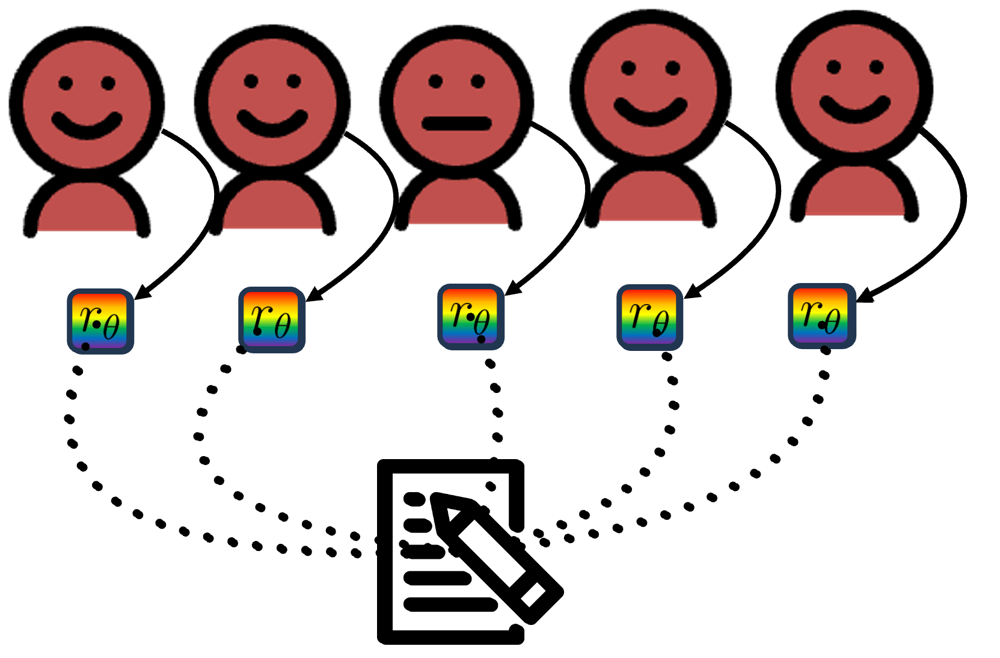

# Official Repository for Global Reward to Local Rewards: Multimodal-Guided Decomposition for Improving Dialogue Agents (EMNLP 2024)

<br />
<div align="center">
  <a href="https://github.com/othneildrew/Best-README-Template">
    
  </a>

  <h3 align="center">GELI: Global Explict Local Implicit Reward Decomposition</h3>

  <p align="center">
    Try the GELI-trained Llama model at HuggingFace!
    <br />
    <a href="https://github.com/othneildrew/Best-README-Template"><strong>HF Model Card»</strong></a>
    <br />
    <br />
    <a href="https://github.com/othneildrew/Best-README-Template">Paper</a>
    ·
    <a href="https://github.com/othneildrew/Best-README-Template/issues/new?labels=bug&template=bug-report---.md">Pre-Trained Reward Functions</a>
    ·
    <a href="https://github.com/othneildrew/Best-README-Template/issues/new?labels=enhancement&template=feature-request---.md">CANDOR Dataset</a>
  </p>
</div>

This is the official repository for *Global Reward to Local Rewards: Multimodal-Guided Decomposition for Improving Dialogue Agents* presented at EMNLP 2024 (Oral). 

The CANDOR dataset can be downloaded here after signing the required license forms. Our models and weights strictly follow the same terms as originally listed in the original terms and conditions as the CANDOR dataset: [CANDOR Dataset Download](https://betterup-data-requests.herokuapp.com/)

Our Arxiv Paper can be found here: [Global Reward to Local Rewards: Multimodal-Guided Decomposition for Improving Dialogue Agents](https://arxiv.org/pdf/2403.11330)

 [![CC BY-NC-SA 4.0][cc-by-nc-sa-shield]][cc-by-nc-sa]
 
[cc-by-nc-sa]: http://creativecommons.org/licenses/by-nc-sa/4.0/
[cc-by-nc-sa-image]: https://licensebuttons.net/l/by-nc-sa/4.0/88x31.png
[cc-by-nc-sa-shield]: https://img.shields.io/badge/License-CC%20BY--NC--SA%204.0-lightgrey.svg

# Overview

This repo is divided into the following sections:

* `Setting up Environment` -- Setting up the environment 
* `CANDOR Dataset Download` -- Downloading CANDOR dataset, which our models were trained on 
* `Reward Function Training` -- Scripts to Train LI and GELI. 
* `Using GELI for Reinforcement Learning with Human Feedback (RLHF)` -- Scripts to Train Llama with GELI with RLHF
* `Accessing Pre-trained Reward Functions` -- Downloading trained reward functions with LI and GELI (These are not required and be trained from scatch but we share these weights for convenience)


## Setting up the Environment

Activate a Conda Environment or virtual env, then use the requirements.txt file to download all the dependencies.
```
pip install -r requirements.txt
```

## CANDOR Dataset Download

Our work relies on the [CANDOR Dataset](https://www.science.org/doi/10.1126/sciadv.adf3197), due to its long-term nature (length of conversations 31.3 mins on average), large-size (1656 conversations, 7+ million words, 850-hours). The CANDOR dataset also includes video data. Download the dataset from [HERE](https://betterup-data-requests.herokuapp.com/), read through the terms carefully. Then place the downloaded data into the `./candor` folder and unzip as necessary. The data should be stored such that for each pair, there is a unique id. For example, `./candor/0a0cf5b9-84f6-4d8d-8001-ec7fd4b7437a`

## GELI: Reward Function Training

We first train the reward function using just LI. Here we use the facial affect classifier as a proxy reward. 

```
python train_reward_LI_only.py --reward_class overall_affect --model convo --batch_size 32 --K 32 --train_size 500 --val --small_model_shrink
```

This will output a reward model that are saved to [THIS](https://github.com/dondongwon/GELI/tree/main/SINGLE_INDEX_reward_function_convo_overall_affect_contra_False_shrink_False_curriculum_False_curriculum_exposureFalse) folder, which is saved with the wandb experiment name.  For example, our best wandb experiment name was `devout-brook-114`, so it is saved in the folder as: `reward1_devout-brook-114`. The language model is also saved as `lang_model_devout-brook-114`. 

Then, we will train the reward function using LI and GE. Here we use RRD as the global reward decomposition. 

```
python train_reward_GELI.py --redist_type RRD --reward_class overall_affect --model convo --batch_size 1 --K 160 --train_size 100 --train --val --small_model_shrink --affect_path devout-brook-114
```
This will output a reward model that are saved to [THIS](https://github.com/dondongwon/GELI/tree/main/visual_feedback_baselines_convo_overall_affect_baseline_RRD_K_160) folder, which is again saved with the wandb experiment name.  For example, our best wandb experiment name was `reward1_eager-glade-5`, so it is saved in the folder as: `reward1_eager-glade-5`.  

## Using GELI for RLHF

Finally, we can run RLHF with GELI with the following code.

```
python train_rl_GELI.py --model_name llama --exp_name GELI --reward redistributed_reward --rf_model GELI --train --val --batch_size 24
```
We use PEFT in our implementation, this will save the adapter weights in `./rlmf_weights`. 

## Accessing Pre-trained Reward Functions

We share the pre-trained reward functions here.

- LI-Only: [Drive](https://drive.google.com/file/d/1_m8n2gWSo9GV9SDXE1f5H6s-HBUwlT4Y/view?usp=sharing). 
- GELI: [Folder](https://github.com/dondongwon/GELI/tree/main/visual_feedback_baselines_convo_overall_affect_baseline_RRD_K_160)

Place them in the respective folders, if you would like to skip training them yourself. 


<!-- LICENSE -->
## License

Unless noted otherwise, we are strictly following the terms under that released by the CANDOR Dataset. 

All other the contesnts of this repository are released under a [Creative Commons Attribution-NonCommercial-ShareAlike 4.0 International License][cc-by-nc-sa].

[![CC BY-NC-SA 4.0][cc-by-nc-sa-image]][cc-by-nc-sa]


<!-- CONTACT -->
## Contact

Dong Won Lee - X:[@_dongwonlee](https://twitter.com/_dongwonlee) - Email: dongwonl@mit.edu

<p align="right">(<a href="#readme-top">back to top</a>)</p>


<!-- ACKNOWLEDGMENTS -->
## Acknowledgments

We gratefully acknowledge and the creators and researchers of the following works, that were a huge enabler to making this project happen. 

* [TRL](https://github.com/huggingface/trl)
* [CANDOR Dataset](https://www.science.org/doi/10.1126/sciadv.adf3197)

<p align="right">(<a href="#readme-top">back to top</a>)</p>


